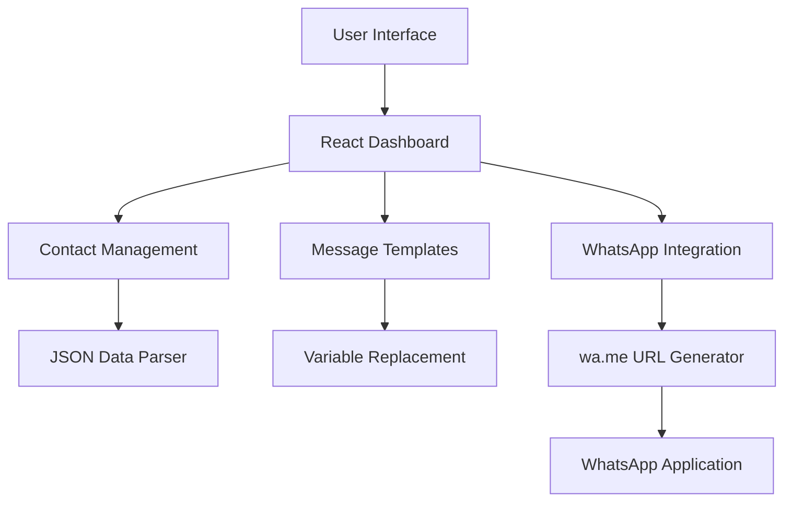

# 🚀 WA Bulk | واتساب بالك

> **Professional WhatsApp Marketing Tool - Send personalized bulk messages to your customers with ease and efficiency**

[](https://kariemseiam.github.io/wa-bulk/)
[](#)
[](#license)
[](#)

**Transform your customer communication with a modern, intuitive WhatsApp bulk messaging solution that respects privacy and maximizes engagement.**

[🌐 Live Demo](https://kariemseiam.github.io/wa-bulk/) • [📚 Documentation](#documentation) • [🤝 Contributing](#contributing) • [📞 Support](#support)

---

## ⚡ Quick Start

### Prerequisites
- Modern web browser (Chrome, Firefox, Safari, Edge)
- WhatsApp installed on your device
- Customer data in JSON format

### Instant Usage
1. **Visit the App**: [https://kariemseiam.github.io/wa-bulk/](https://kariemseiam.github.io/wa-bulk/)
2. **Upload Data**: Import your customer list as JSON
3. **Customize Message**: Create personalized message templates
4. **Start Messaging**: Send targeted WhatsApp messages with one click

**✨ That's it! No installation required - runs entirely in your browser**

---

## 🌟 Features

### 🎯 Core Capabilities
- **📱 Direct WhatsApp Integration** - Opens WhatsApp with pre-filled messages
- **📊 Smart Contact Management** - Organize customers into lists with status tracking
- **🎨 Message Templates** - Dynamic variables for personalized messaging
- **📈 Real-time Analytics** - Track message delivery and engagement stats
- **🌍 Arabic RTL Support** - Native Arabic interface with proper text direction
- **📱 Responsive Design** - Works perfectly on desktop, tablet, and mobile

### 💫 What Makes This Special
- **🔒 Privacy First**: No data stored on external servers - everything runs locally
- **⚡ Lightning Fast**: Modern React architecture with optimized performance
- **🎭 Beautiful UI**: Glassmorphism design with smooth animations
- **🛡️ Status Tracking**: Monitor connection status for each contact
- **📋 Bulk Operations**: Handle hundreds of contacts efficiently

### 📊 Feature Comparison

| Feature | WA Bulk | Traditional Tools |
|---------|---------|-------------------|
| **Privacy** | ✅ Local Processing | ❌ Server Dependent |
| **Real-time Status** | ✅ Live Updates | ❌ Static Lists |
| **Arabic Support** | ✅ Native RTL | ❌ Limited |
| **Mobile Friendly** | ✅ Responsive | ❌ Desktop Only |
| **Free to Use** | ✅ Open Source | ❌ Paid Plans |

---

## 📚 Documentation

### 🎮 Usage Guide

#### Getting Started
1. **Access the Application**
   - Visit [https://kariemseiam.github.io/wa-bulk/](https://kariemseiam.github.io/wa-bulk/)
   - The app loads instantly in your browser

2. **Prepare Your Data**
   - Format your customer data as JSON
   - Required fields: `name`, `phone_number`, `facebook_url` (optional)

3. **Create a Campaign**
   ```json
   [
     {
       "name": "أحمد محمد",
       "phone_number": "+201234567890",
       "facebook_url": "https://facebook.com/ahmed"
     },
     {
       "name": "فاطمة علي", 
       "phone_number": "+201987654321"
     }
   ]
   ```

#### Message Templates
Create dynamic messages using variables:
- `${name}` - Customer name
- `${phone_number}` - Phone number  
- `${facebook_url}` - Facebook profile

**Example Template:**
```
مرحباً ${name}! 👋
نحن سعداء لخدمتك في متجرنا.
للتواصل: ${phone_number}
```

#### Status Management
- **🟢 Connected**: Ready to send messages
- **🟡 Not Connected**: Needs verification
- **🔴 Unsupported**: Invalid phone number

### ⚙️ Configuration

#### Supported Data Format
```json
{
  "customers": [
    {
      "name": "Customer Name",
      "phone_number": "+1234567890",
      "facebook_url": "https://facebook.com/profile"
    }
  ]
}
```

#### Message Variables
| Variable | Description | Example |
|----------|-------------|---------|
| `${name}` | Customer name | أحمد محمد |
| `${phone_number}` | Phone number | +201234567890 |
| `${facebook_url}` | Facebook URL | https://facebook.com/profile |

### 🔧 Advanced Features

#### List Management
- Create multiple customer lists
- Switch between campaigns
- Update message templates per list
- Track statistics for each list

#### Analytics Dashboard
- Total contacts count
- Connection status breakdown
- Message delivery tracking
- Performance metrics

---

## 🏗️ Architecture



### 🛠️ Tech Stack
- **Frontend**: React 18 with modern hooks and context
- **Styling**: Tailwind CSS with custom glassmorphism components
- **Icons**: Lucide React for consistent iconography
- **Animations**: Framer Motion for smooth interactions
- **Routing**: React Router for navigation
- **Build Tool**: Vite for fast development and optimized builds

### ⚡ Performance
- **Bundle Size**: < 1MB compressed
- **Load Time**: < 2 seconds on 3G
- **Memory Usage**: < 50MB runtime
- **Responsive**: 60fps animations on mobile

### 🔒 Security & Privacy
- **Local Processing**: All data handled client-side
- **No Server Storage**: Customer data never leaves your device
- **HTTPS Only**: Secure connection required
- **WhatsApp Integration**: Uses official wa.me links

---

## 🛠️ Development

### Environment Setup
```bash
# Clone the repository
git clone https://github.com/kariemSeiam/wa-bulk.git
cd wa-bulk

# Install dependencies
npm install

# Start development server
npm run dev

# Build for production
npm run build

# Preview production build
npm run preview
```

### Project Structure
```
wa-bulk/
├── public/                 # Static assets
│   └── vite.svg           # Favicon
├── src/                   # Source code
│   ├── assets/            # Images and icons
│   ├── contexts/          # React contexts
│   │   └── AuthContext.jsx
│   ├── PlacesGrid.jsx     # Contact management component
│   ├── WhatsAppDashboard.jsx # Main dashboard
│   ├── main.jsx           # App entry point
│   └── index.css          # Global styles
├── package.json           # Dependencies and scripts
├── tailwind.config.js     # Tailwind configuration
├── vite.config.js         # Vite build configuration
└── README.md              # This file
```

### Development Workflow
1. **Feature Development**
   - Create feature branch from main
   - Implement changes with proper testing
   - Ensure responsive design works

2. **Code Quality**
   - Follow ESLint configuration
   - Use Prettier for formatting
   - Write semantic commit messages

3. **Testing**
   ```bash
   npm run lint        # Check code quality
   npm run build       # Test production build
   npm run preview     # Test built application
   ```

### Component Architecture
- **WhatsAppDashboard**: Main application container
- **PlacesGrid**: Contact list and management
- **AddListDialog**: New campaign creation
- **AuthContext**: User authentication state

---

## 🚀 Deployment

### GitHub Pages (Current)
The application is deployed using GitHub Pages with automatic deployment:

```yaml
# .github/workflows/deploy.yml
name: Deploy to GitHub Pages
on:
  push:
    branches: [ main ]
jobs:
  deploy:
    runs-on: ubuntu-latest
    steps:
      - uses: actions/checkout@v2
      - name: Setup Node.js
        uses: actions/setup-node@v2
        with:
          node-version: '18'
      - run: npm install
      - run: npm run build
      - name: Deploy
        uses: peaceiris/actions-gh-pages@v3
        with:
          github_token: ${{ secrets.GITHUB_TOKEN }}
          publish_dir: ./dist
```

### Alternative Deployment Options

#### Netlify
```bash
npm run build
npx netlify deploy --prod --dir=dist
```

#### Vercel
```bash
npm run build
npx vercel --prod
```

#### Self-hosted
```bash
npm run build
# Serve dist/ folder with any web server
```

---

## 📊 Project Status

- **Development Status**: ✅ Active Development
- **Latest Version**: v1.0.1 ([Release Notes](https://github.com/kariemSeiam/wa-bulk/releases))
- **Browser Support**: Chrome 90+, Firefox 88+, Safari 14+, Edge 90+
- **Mobile Support**: iOS 14+, Android 8+

### 🗺️ Roadmap
- [ ] **v1.1**: CSV import support
- [ ] **v1.2**: Message scheduling
- [ ] **v1.3**: Advanced analytics
- [ ] **v1.4**: Team collaboration features
- [ ] **v2.0**: Multi-language support

---

## 🤝 Contributing

We welcome contributions! This project follows the [Contributor Covenant](https://www.contributor-covenant.org/) code of conduct.

### Development Process
1. **Fork** the repository
2. **Clone** your fork locally
3. **Create** a feature branch (`git checkout -b feature/amazing-feature`)
4. **Commit** your changes (`git commit -m 'Add amazing feature'`)
5. **Push** to the branch (`git push origin feature/amazing-feature`)
6. **Open** a Pull Request

### Code Style Guidelines
- Use functional components with hooks
- Follow ESLint configuration
- Write descriptive commit messages
- Add comments for complex logic
- Ensure mobile responsiveness

### Areas for Contribution
- 🌍 Additional language translations
- 🎨 UI/UX improvements
- ⚡ Performance optimizations
- 📱 Mobile experience enhancements
- 🔧 New feature development

---

## 🆘 Support

### 📖 Documentation
- [GitHub Wiki](https://github.com/kariemSeiam/wa-bulk/wiki) - Detailed guides
- [Issues](https://github.com/kariemSeiam/wa-bulk/issues) - Known issues and solutions

### 🐛 Bug Reports
Found a bug? Please report it:
1. Check [existing issues](https://github.com/kariemSeiam/wa-bulk/issues)
2. Create a [new issue](https://github.com/kariemSeiam/wa-bulk/issues/new) with:
   - Clear description
   - Steps to reproduce
   - Expected vs actual behavior
   - Browser and device information

### 💬 Community
- [Discussions](https://github.com/kariemSeiam/wa-bulk/discussions) - Feature requests and general chat
- [Twitter](https://twitter.com/kariemSeiam) - Follow for updates

### 📧 Direct Contact
- **Email**: [kariem.seiam@gmail.com](mailto:kariem.seiam@gmail.com)
- **GitHub**: [@kariemSeiam](https://github.com/kariemSeiam)

---

## 📄 License

This project is licensed under the **MIT License** - see the [LICENSE](LICENSE) file for details.

### What this means:
- ✅ **Commercial use** allowed
- ✅ **Modification** allowed  
- ✅ **Distribution** allowed
- ✅ **Private use** allowed
- ❌ **No warranty** provided
- ❌ **No liability** assumed

---

## 🙏 Acknowledgments

### 💡 Inspiration
- Modern WhatsApp Business API limitations
- Need for privacy-focused marketing tools
- Arabic-speaking business community requirements

### 🛠️ Built With
- [React](https://reactjs.org/) - UI framework
- [Tailwind CSS](https://tailwindcss.com/) - Styling framework
- [Vite](https://vitejs.dev/) - Build tool
- [Lucide React](https://lucide.dev/) - Icon library
- [Framer Motion](https://www.framer.com/motion/) - Animation library

### 🌟 Special Thanks
- **Arabic Business Community** for feedback and testing
- **Open Source Contributors** for code improvements
- **WhatsApp** for providing the wa.me URL scheme
- **GitHub** for free hosting via GitHub Pages

---

<div align="center">

**Made with ❤️ for the Arabic business community**

[⭐ Star this repo](https://github.com/kariemSeiam/wa-bulk) • [🍴 Fork it](https://github.com/kariemSeiam/wa-bulk/fork) • [📢 Share it](https://twitter.com/intent/tweet?text=Check%20out%20WA%20Bulk%20-%20WhatsApp%20Marketing%20Tool&url=https://github.com/kariemSeiam/wa-bulk)

</div>
